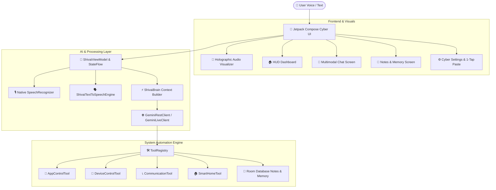

<div align="center">

# ⚡ SHIVAI (शिवाय) — Futuristic AI Assistant
### *Next-Generation Multimodal AI Voice Assistant for Android*

[](https://kotlinlang.org)
[](https://developer.android.com/jetpack/compose)
[](https://ai.google.dev/)
[](https://developer.android.com)
[](https://gradle.org)
[](LICENSE)

<br/>

```
  ____   _   _  ___ __     __    _      ___ 
 / ___| | | | ||_ _|\ \   / /   / \    |_ _|
 \___ \ | |_| | | |  \ \ / /   / _ \    | | 
  ___) ||  _  | | |   \ V /   / ___ \   | | 
 |____/ |_| |_||___|   \_/   /_/   \_\ |___|
       NEXT-GEN CYBERNETIC AI ASSISTANT     
```

<p align="center">
  <b>शिवाय (Shivai)</b> एक अत्याधुनिक, सायबरपंक और साइंस-फिक्शन प्रेरित पर्सनल एआई असिस्टेंट है। यह Android के आधुनिक <b>Jetpack Compose</b>, <b>Gemini Multimodal AI</b>, और <b>नेटिव स्पीच इंजन</b> से संचालित है जो हिंदी और अंग्रेजी दोनों भाषाओं में रियल-टाइम बातचीत, डिवाइस ऑटोमेशन और सिस्टम कंट्रोल करने में सक्षम है।
</p>

---

[✨ Features](#-key-features) • [🏛 Architecture](#-system-architecture) • [🚀 Quick Start](#-getting-started) • [📱 Tech Stack](#-technology-stack) • [⚙️ Configuration](#-api-key-configuration) • [📜 License](#-license)

</div>

---

## 🌟 Key Features (मुख्य विशेषताएं)

### 🎙️ 1. Ultra-Low Latency Voice Engine (रियल-टाइम वॉयस असिस्टेंट)
- **नेटिव SpeechRecognizer API:** किसी भी बाहरी डायलॉग के बिना सीधे ऐप के भीतर रियल-टाइम वॉयस इनपुट।
- **द्विभाषी पहचान (Hindi & English):** देवनागरी लिपि हिंदी और अंग्रेजी दोनों को ऑटो-डिटेक्ट करके प्रोसेस करता है।
- **होलोग्राफिक ऑडियो विज़ुअलाइज़र:** बोलते समय आपकी आवाज़ के RMS एम्प्लिट्यूड के अनुसार स्क्रीन पर साइबर नियॉन तरंगें और पल्स विज़ुअल्स सिंक होते हैं।

### 🗣️ 2. Natural Text-To-Speech (प्राकृतिक आवाज़ आउटपुट)
- **स्मार्ट स्क्रिप्ट डिटेक्शन:** टेक्स्ट का विश्लेषण कर हिंदी (`hi-IN`) और इंग्लिश (`en-IN`) में से सही भाषा और सर्वश्रेष्ठ न्यूरल वॉयस चुनता है।
- **क्लीन स्पीच सैनिटाइज़र:** AI के रिस्पांस में आने वाले मार्कडाउन स्टार्स (`**bold**`), कोड सिंबल (`` `code` ``), और लिंक्स को स्वतः हटाकर स्वाभाविक मानवीय बातचीत जैसा बोलता है।
- **ऑडियो फोकस डकिंग (Audio Ducking):** शिवाय के बोलते समय बैकग्राउंड मीडिया की आवाज़ धीमी हो जाती है।

### 📋 3. Frictionless API Key Management (1-टैप व लॉन्ग-प्रेस पेस्ट)
- **लॉन्ग-प्रेस संदर्भ मेनू (Long-Press Context Menu):** इनपुट बॉक्स पर कहीं भी 1 सेकंड दबाकर रखने पर फ्लोटिंग **PASTE** पॉपअप मेनू खुलता है।
- **ऑटो-क्लीन व डीप सैनिटाइजेशन:** वेब ब्राउज़र से कॉपी करते समय आने वाले अदृश्य यूनीकोड वर्ण (Zero-width spaces `\u200B`, `\uFEFF`, नॉन-ब्रेकिंग स्पेस `\u00A0`), कोट्स और न्यूलाइन्स को तुरंत साफ़ करता है।
- **1-टैप ऑटो-सेव व टेस्ट:** चाबी पेस्ट होते ही अपने आप सेव होकर Google के आधिकारिक मॉडल्स एंडपॉइंट से वेरिफाई हो जाती है।

### 🛠️ 4. Device Automation & Deep Hardware Tools (सिस्टम ऑटोमेशन)
- **📱 ऐप लॉन्चर:** किसी भी इंस्टॉल ऐप (YouTube, WhatsApp, Camera, Settings, Phone आदि) को वॉयस कमांड से तुरंत खोलना।
- **🔦 हार्डवेयर नियंत्रण:** फ्लैशलाइट (Torch), वॉल्यूम एडजस्टमेंट, स्क्रीन ब्राइटनेस, और Android 12+ हैप्टिक वाइब्रेशन।
- **📞 संचार टूल:** वॉयस कमांड द्वारा डायरेक्ट फोन कॉल लगाना, SMS भेजना और WhatsApp चैट शुरू करना।
- **📝 पर्सनल नोट्स और मेमोरी:** Room SQLite डेटाबेस के ज़रिए यूजर की पसंद, मीटिंग नोट्स और बातचीत को सुरक्षित ऑफलाइन स्टोर करना।
- **🏠 स्मार्ट होम (IoT):** Home Assistant API के माध्यम से स्मार्ट लाइट्स, स्विच और डिवाइसेज को कंट्रोल करना।
- **🌐 वेब सर्च व नॉलेज ग्राउंडिंग:** ताज़ा समाचारों और सवालों के लिए लाइव वेब सर्च।

### 🛡️ 5. Cyber Shield & Ethical Hacking Defense (साइबर सुरक्षा व फ़्रॉड डिफेंस)
- **🔗 फ़िशिंग व मैलवेयर लिंक स्कैनर:** किसी भी संदेहास्पद लिंक के TLDs, IP-बेस्ड होस्ट और बैंकिंग टाइपो-स्क्वैटिंग की जांच कर तत्काल सुरक्षा स्कोर प्रदान करता है।
- **💳 बैंकिंग व SMS फ्रॉड एनालाइज़र:** बिजली बिल कटने, फर्जी KYC अपडेट, लॉटरी और OTP चोरी वाले संदेशों को पहचानकर अलर्ट जारी करता है।
- **🚨 राष्ट्रीय साइबर हेल्पलाइन (1930):** वित्तीय धोखाधड़ी की स्थिति में 1-टैप आपातकालीन 1930 हेल्पलाइन डायलर।
- **🔍 डिवाइस सुरक्षा ऑडिट:** Root एक्सेस, USB डिबगिंग (ADB), और नेटवर्क एन्क्रिप्शन की जांच।

### 💻 6. Autonomous DevSecOps Coding Studio (ऑटोनॉमस कोडिंग व बग फिक्सर)
- **⚡ मल्टी-लैंग्वेज कोड जनरेटर:** Kotlin, Python, JavaScript, Shell, Rust, C++ में प्रोडक्शन-ग्रेड कोड तैयार करना।
- **🐛 बग फाइंडर व सिक्योरिटी फिक्सर:** कोड में मौजूद सिंटैक्स त्रुटियों, लॉजिकल खामियों और OWASP सुरक्षा कमजोरियों को स्वतः ढूंढकर ठीक करना।

### ⚡ 7. Dual Engine: Online + Hybrid Offline Mode (ऑनलाइन व ऑफलाइन दोनों में सक्षम)
- **ऑनलाइन मोड:** Google Gemini 2.5 Flash / 2.0 Live WebSocket द्वारा उच्च-स्तरीय मल्टीमॉडल रीजनिंग।
- **ऑफलाइन कॉग्निटिव इंजन:** बिना इंटरनेट के भी डिवाइस हार्डवेयर (टॉर्च, वॉल्यूम, ऐप लॉन्च), नोट्स, टाइम, सुरक्षा ऑडिट व स्थानीय शब्दकोश स्वतः निष्पादित होते हैं।

### 🌐 8. Adaptive Multilingual Linguistic Brain (क्षेत्रीय भाषा व शब्दकोश सीखना)
- **स्व-शिक्षण शब्दकोश (Self-Learning Lexicon):** भोजपुरी, मैथिली, मारवाड़ी, संस्कृत जैसी भाषाओं या बोलियों के नए शब्दों को सिखाने पर शिवाय उन्हें अपनी सक्रिय मेमोरी और बातचीत में स्वतः शामिल कर लेता है।

---

## 🏛 System Architecture (सिस्टम आर्किटेक्चर)



---

## 📱 Technology Stack (प्रयुक्त तकनीक)

| Component | Technology | Description |
|---|---|---|
| **Language** | Kotlin 2.0+ | Coroutines, Flow, StateFlow, CoroutineScope |
| **UI Toolkit** | Jetpack Compose | Material Design 3, Cyberpunk Dark Theme, Custom HUD Canvas |
| **AI Model** | Google Gemini | `gemini-2.5-flash`, `gemini-2.0-flash`, Gemini Multimodal Live WebSocket |
| **Speech-To-Text** | Android SpeechRecognizer | On-device & Network bilingual streaming speech recognition |
| **Text-To-Speech** | Android TextToSpeech Engine | Multi-lingual Neural voice selection with Audio Focus Management |
| **Local Database** | Room SQLite | Type converters, Entities, DAOs for Notes, Memory, and Chat history |
| **Networking** | OkHttp 3 | REST API client and real-time bidirectional WebSockets |
| **Build System** | Gradle 9.3.1 (Kotlin DSL) | Android Gradle Plugin 8.9+, Configuration Cache enabled |

---

## 🚀 Getting Started (शुरू कैसे करें)

### पूर्व-आवश्यकताएं (Prerequisites)
- **Android Studio** Ladybug / Meerkat (2024.2+) या AI Studio Android Runtime
- **JDK 17** या नया
- **Android Device / Emulator** (Android 8.0 Oreo, API 26+)

### 1. रिपॉजिटरी क्लोन करें (Clone Repository)
```bash
git clone https://github.com/your-username/shivai-android.git
cd shivai-android
```

### 2. प्रोजेक्ट बिल्ड करें (Build the Project)
```bash
# Debug APK तैयार करने के लिए
gradle :app:assembleDebug
```
निर्मित APK का स्थान:
`app/build/outputs/apk/debug/app-debug.apk`

---

## ⚙️ API Key Configuration (एपीआई की सेटअप)

1. [Google AI Studio](https://aistudio.google.com/) पर जाएं और अपनी फ्री **Gemini API Key** बनाएं।
2. शिवाय ऐप खोलें और नीचे दिए गए **Settings (⚙️)** टैब पर जाएं।
3. **"PASTE FROM CLIPBOARD"** बटन पर टैप करें या इनपुट बॉक्स पर **लॉन्ग-प्रेस (Long press)** करके **"PASTE"** चुनें।
4. ऐप स्वतः आपकी की को सैनिटाइज, सेव और Google सर्वर से वेरिफाई कर देगा!

> 💡 **टिप:** यदि आप सीधे बिल्ड टाइम पर की जोड़ना चाहते हैं, तो रूट डायरेक्टरी में `.env` फ़ाइल में की दर्ज कर सकते हैं:
> ```env
> GEMINI_API_KEY=AIzaSyYourGeneratedApiKeyHere
> ```

---

## 📂 Project Directory Structure (प्रोजेक्ट डायरेक्टरी संरचना)

```
shivai-android/
├── app/
│   ├── src/main/
│   │   ├── java/com/example/
│   │   │   ├── MainActivity.kt               # Main Single Activity & Navigation Container
│   │   │   ├── ShivaiApplication.kt          # Global Application singleton & DI setup
│   │   │   ├── ai/                           # Gemini AI Engine & REST/Live WebSocket Clients
│   │   │   │   ├── GeminiRestClient.kt       # Multi-turn generation & Tool execution
│   │   │   │   ├── GeminiLiveClient.kt       # Real-time WebSocket audio streaming
│   │   │   │   └── ShivaiBrain.kt            # System prompts & Agent reasoning
│   │   │   ├── data/local/                   # Room Database entities, DAOs, & Preferences
│   │   │   │   ├── ShivaiDatabase.kt         # SQLite Database declaration
│   │   │   │   └── SettingsPreferences.kt    # Secure preferences & API key sanitizer
│   │   │   ├── tools/                        # 10+ Android Device & Automation Tools
│   │   │   │   ├── AppControlTool.kt         # Installed apps launcher
│   │   │   │   ├── DeviceControlTool.kt      # Flashlight, volume, vibration
│   │   │   │   ├── CommunicationTool.kt      # Phone calls, SMS, WhatsApp
│   │   │   │   └── SmartHomeTool.kt          # Home Assistant IoT integration
│   │   │   ├── ui/                           # Jetpack Compose Screens & Holographic HUD
│   │   │   │   ├── ShivaiViewModel.kt        # Master ViewModel & StateFlow management
│   │   │   │   ├── screens/                  # Home, Chat, Notes, Settings screens
│   │   │   │   └── theme/                    # Cyberpunk Neon Color Scheme & Typography
│   │   │   └── voice/                        # Native Speech & Text-To-Speech Engines
│   │   │       ├── RealtimeSpeechRecognizer.kt# Native real-time STT listener
│   │   │       └── ShivaiTextToSpeechEngine.kt# Natural Hindi & English TTS engine
│   │   ├── AndroidManifest.xml               # Permissions, Queries & Hardware features
│   │   └── res/                              # Drawables, Strings, Adaptive Icons
│   └── build.gradle.kts                      # Module build configuration & dependencies
├── gradle/libs.versions.toml                 # Version catalog
├── settings.gradle.kts                       # Root project settings
├── metadata.json                             # AI Studio project platform metadata
└── README.md                                 # Project documentation
```

---

## 🔒 Permissions & Security (सुरक्षा व अनुमतियां)

शिवाय केवल वही अनुमतियां मांगता है जो असिस्टेंट के सुचारू संचालन के लिए आवश्यक हैं:
- `RECORD_AUDIO`: रियल-टाइम वॉयस कमांड सुनने के लिए।
- `CALL_PHONE` / `SEND_SMS`: यूजर द्वारा दिए गए वॉयस निर्देश पर कॉल लगाने या मैसेज भेजने के लिए।
- `CAMERA`: फ्लैशलाइट (टॉर्च) नियंत्रण के लिए।
- `VIBRATE`: हैप्टिक रिस्पॉन्स के लिए।
- `INTERNET`: Gemini AI सर्वर और वेदर/सर्च रिक्वेस्ट के लिए।

---

## 🤝 Contributing (योगदान)

1. रिपॉजिटरी को Fork करें।
2. अपनी फ़ीचर ब्रांच बनाएं (`git checkout -b feature/AmazingFeature`).
3. बदलाव कमिट करें (`git commit -m 'Add some AmazingFeature'`).
4. ब्रांच को पुश करें (`git push origin feature/AmazingFeature`).
5. Pull Request खोलें।

---

## 📜 License (लाइसेंस)

यह प्रोजेक्ट **MIT License** के तहत खुला स्रोत (Open Source) है। विवरण के लिए [LICENSE](LICENSE) फ़ाइल देखें।

<div align="center">
  <sub>बिल्ट विथ ❤️ और आधुनिक Android टेक्नोलॉजी द्वारा संचालित</sub>
</div>
